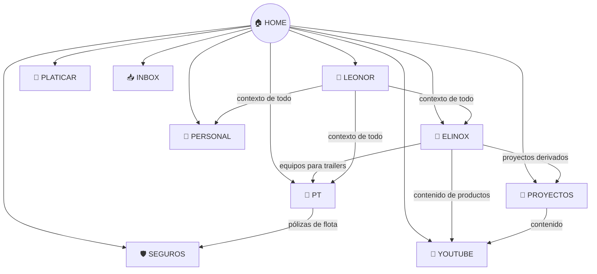

# 🔗 MAPA DE CONEXIONES

> Relaciones entre dominios. Se actualiza automáticamente cada semana.

---

## Diagrama de Conexiones

---

## Conexiones Identificadas

| Dominio A | Dominio B | Tipo de conexión |
|-----------|-----------|-----------------|
| Elinox | PT | Equipos para food trailers |
| Elinox | YouTube | Contenido usando productos |
| Elinox | Proyectos | Proyectos que derivan del negocio |
| PT | Seguros | Pólizas de la flota |
| LEONOR | Todos | Contexto y memoria |

---

## Gaps Detectados por el Agente Semanal

<!-- El agente semanal llena esta sección automáticamente -->
