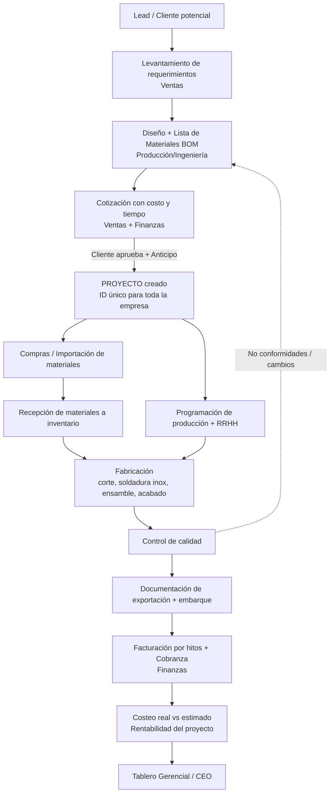
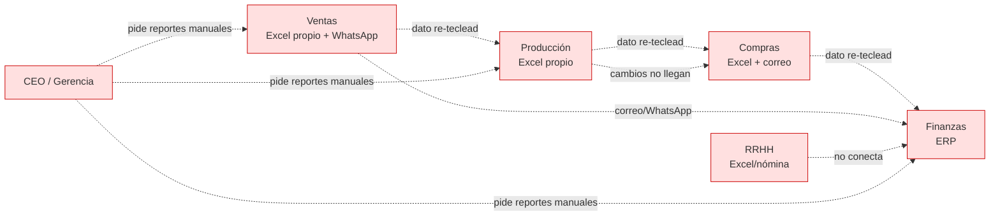
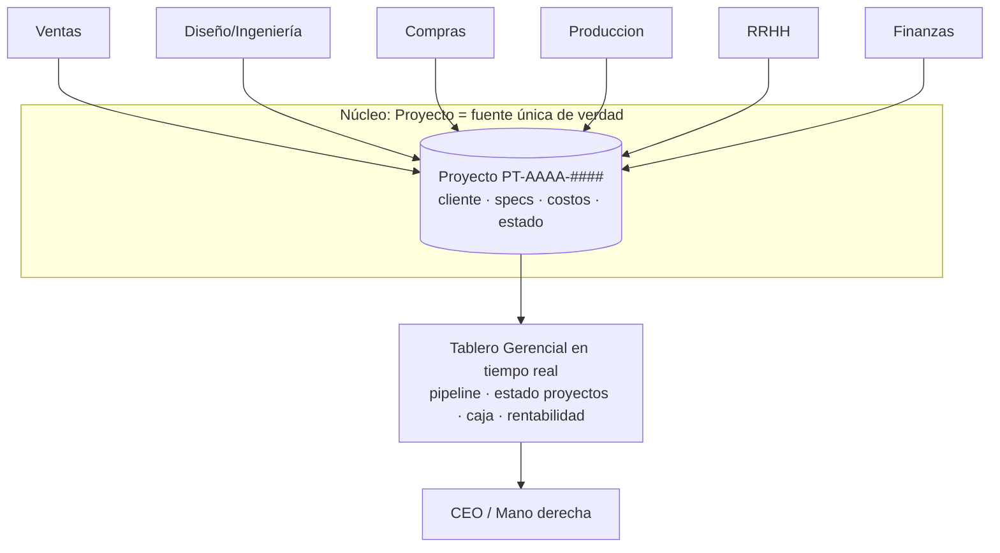

# PANAMERICAN TRAILERS — Mapa de Flujo de Información (v1)

> Documento base para ordenar la empresa e iniciar la integración entre áreas.
> Estado: **Borrador para validar con cada gerente de área.**
> Próximo paso tras validar: diseñar las automatizaciones (ver sección 7).

---

## 1. ¿Qué tipo de empresa somos? (esto define todo el mapa)

PANAMERICAN TRAILERS fabrica **productos a la medida para exportación**:

- Food trailers
- Contenedores modificados
- Trabajos en acero inoxidable

Esto significa que **no vendemos productos de catálogo, vendemos proyectos**. Cada
venta nace como una especificación distinta y se convierte en un proyecto de
fabricación con su propio diseño, materiales, costos y fecha de entrega.

**Conclusión clave:** la información de toda la empresa debe organizarse alrededor
de un único concepto central: **el PROYECTO** (cada food trailer / contenedor /
trabajo vendido). Hoy ese hilo conductor no existe de forma única, y por eso cada
área tiene su "propia versión de la verdad".

---

## 2. Áreas actuales y qué información "dueña" tiene cada una

| Área | Información que ORIGINA (es dueña) | Información que NECESITA de otros |
|---|---|---|
| **Comercial / Ventas** | Cliente, requerimientos/especificación, cotización, pedido en firme, anticipo acordado | Costo estimado y tiempo de fabricación (Producción), condiciones de pago (Finanzas) |
| **Producción (incl. Diseño/Ingeniería)** | Diseño y planos, lista de materiales (BOM), cronograma, avance real, consumo real, control de calidad | Especificación cerrada (Ventas), materiales a tiempo (Compras), personal/horas (RRHH) |
| **Compras / Importación** | Órdenes de compra, costo real de materiales, fechas de importación/aduana, inventario de materiales | Lista de materiales y prioridades (Producción), aprobación de pago (Finanzas) |
| **Finanzas / Contabilidad / Admin** | Facturación, cobranza, pagos, costo real del proyecto, rentabilidad, flujo de caja | Costos reales de TODAS las áreas (materiales, mano de obra, logística) |
| **Recursos Humanos** | Personal, asistencia/horas, asignación a proyectos, nómina | Necesidades de personal por proyecto (Producción) |
| **Gerencia / CEO** | Decisiones, prioridades estratégicas | Tablero consolidado de TODAS las áreas |

> Nota: hoy "Diseño/Ingeniería" parece vivir dentro de Producción. Vale la pena
> validar si debe ser un paso formal y visible, porque es donde nace la lista de
> materiales y el costo objetivo (alimenta a Compras y Finanzas).

---

## 3. Flujo macro: cómo DEBERÍA fluir la información (de la venta a la cobranza)

**Idea central:** todo cuelga del nodo **PROYECTO (ID único)**. Cada documento,
correo, Excel o registro de cualquier área debe poder responder: *"¿a qué proyecto
pertenece?"*. Ese es el pegamento que hoy falta.

---

## 4. Cómo fluye HOY (mapa del problema "as-is")

### Los 4 dolores que confirmaste, ubicados en el flujo

| Dolor | Dónde se rompe el flujo | Síntoma concreto |
|---|---|---|
| **Falta de visión gerencial** | No existe el ID de proyecto único ni un tablero consolidado | El CEO pide reportes manuales y cada área responde con números distintos |
| **Datos duplicados / inconsistentes** | El cliente y la especificación se re-escriben en Ventas → Producción → Compras → Finanzas | El mismo proyecto tiene 4 nombres y cifras que no cuadran |
| **Procesos manuales y lentos** | Cotización, BOM, requisiciones y avance viven en Excel/WhatsApp | Retrabajo, cosas que se pierden, decisiones tardías |
| **Mala comunicación entre áreas** | Cambios de especificación no llegan a Compras/Producción a tiempo | Se compra material equivocado o se fabrica algo que el cliente ya cambió |

---

## 5. La solución de fondo: un "idioma común" antes que más software

Antes de automatizar nada, la empresa necesita **3 maestros únicos** que todas las
áreas usen igual (esto es barato y resuelve el 70% del caos):

1. **Maestro de Clientes** — un solo código por cliente, usado por todos.
2. **Maestro/Catálogo de Productos y Servicios** — categorías estándar
   (food trailer, contenedor modificado, trabajo en inox) con sub-tipos.
3. **ID único de Proyecto** — formato único (ej. `PT-2026-0001`) que aparece en
   cotización, OC, orden de producción, factura y nómina. **Este es el cambio de
   mayor impacto y de menor costo.**

Con eso, aunque sigamos usando Excel + ERP temporalmente, ya se puede *cruzar* la
información. La automatización viene después y es mucho más fácil.

---

## 6. Estado objetivo ("to-be"): fuente única de verdad

Cada área sigue siendo experta en lo suyo, pero **escribe y lee del mismo proyecto**.
La gerencia deja de pedir reportes: los ve solos.

---

## 7. Hoja de ruta de automatización (propuesta de fases)

> Este entorno ya tiene conectado **n8n** (plataforma de automatización), ideal
> para conectar ERP + Excel/Sheets + correo/WhatsApp sin reemplazar todo de golpe.

| Fase | Objetivo | Ejemplos concretos | Esfuerzo |
|---|---|---|---|
| **0. Idioma común** | Definir los 3 maestros (sección 5) | Estandarizar formato de ID de proyecto, catálogo de productos, códigos de cliente | Bajo / alto impacto |
| **1. Quick wins** | Conectar lo que más duele sin cambiar sistemas | Al cerrar venta → crear proyecto + notificar a Producción y Compras automáticamente; alertas de cambios de especificación | Medio |
| **2. Tablero gerencial** | Visión única para el CEO | Consolidar pipeline + estado de proyectos + caja en un dashboard automático | Medio |
| **3. Integración** | Una sola fuente de verdad | Sincronizar ERP ↔ producción ↔ compras alrededor del ID de proyecto | Alto |

---

## 8. Preguntas abiertas para validar con cada área (siguiente sesión)

1. **Ventas:** ¿en qué momento exacto un lead se vuelve "proyecto en firme"? ¿Quién autoriza?
2. **Diseño/Ingeniería:** ¿quién y cómo se genera hoy la lista de materiales (BOM)?
3. **Compras/Importación:** ¿cuánto tarda el ciclo de importación y dónde se atasca (aduana, proveedor, pago)?
4. **Producción:** ¿cómo se mide hoy el avance y el consumo real de material por proyecto?
5. **Finanzas:** ¿el ERP permite costear por proyecto? ¿Cuál ERP es?
6. **RRHH:** ¿se registran horas-hombre por proyecto (para saber el costo real de mano de obra)?
7. **Gerencia:** ¿cuáles son los 5 números que el CEO quiere ver todos los días?

---

*Versión 1 — generada como punto de partida. Se ajustará con el levantamiento por área.*
